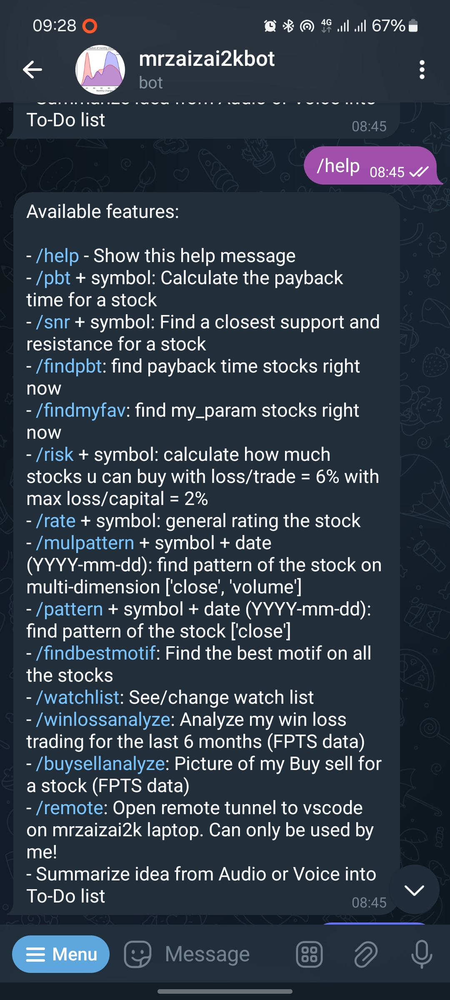
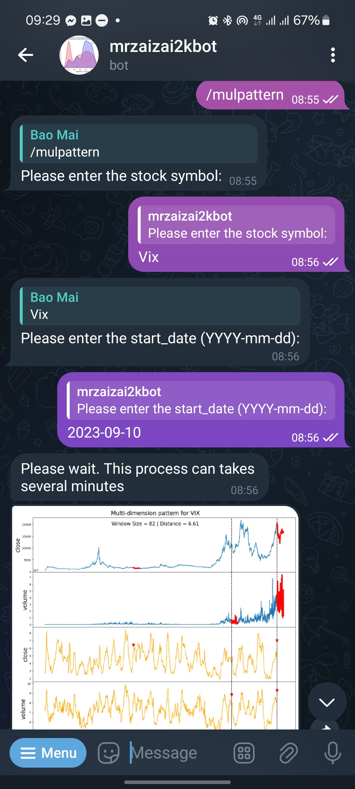
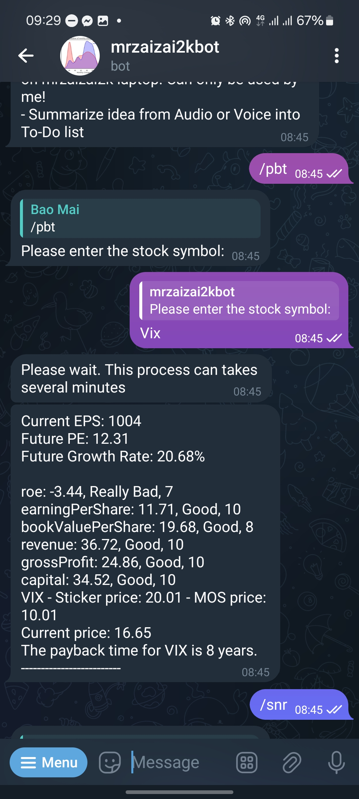
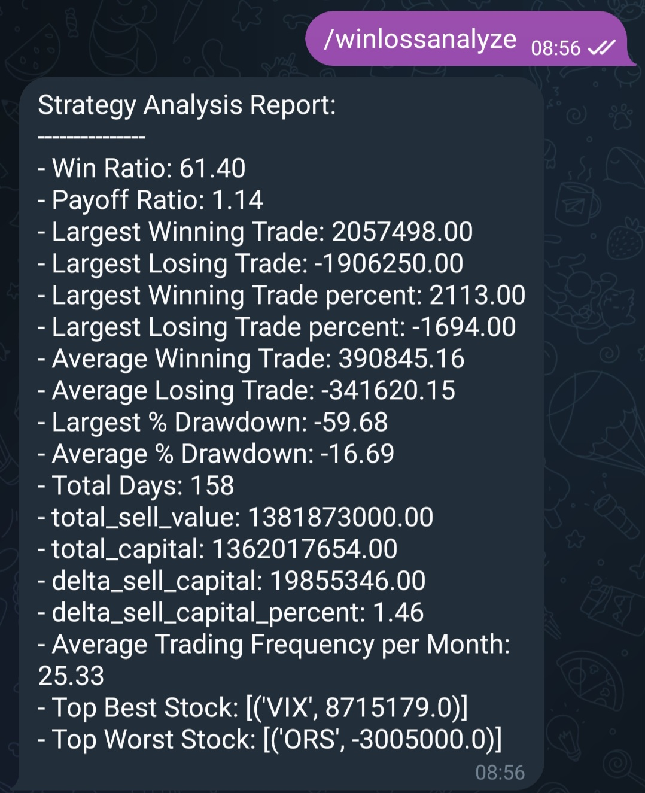
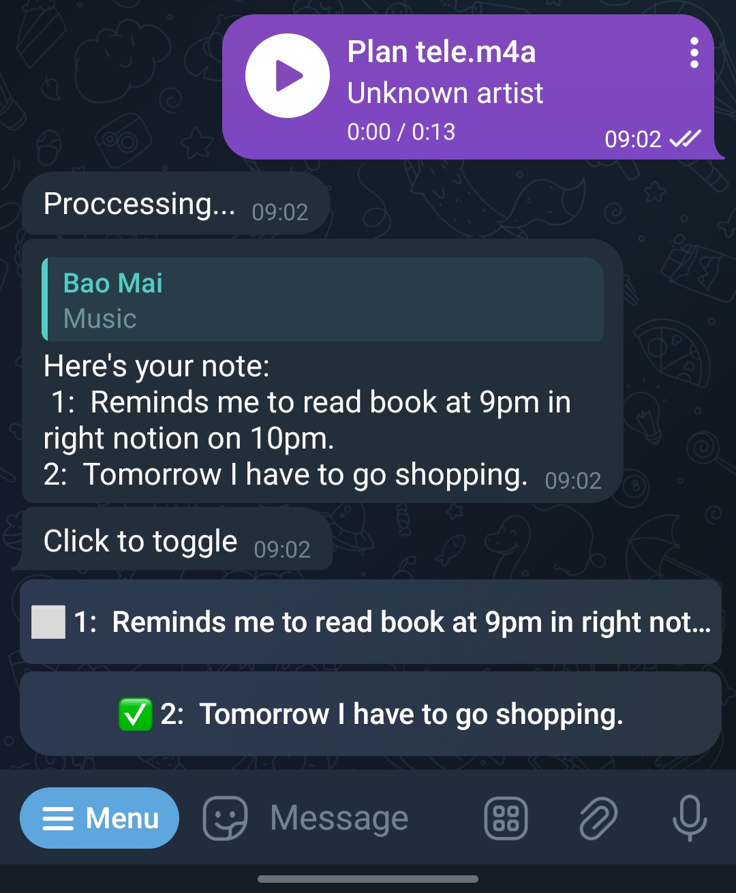
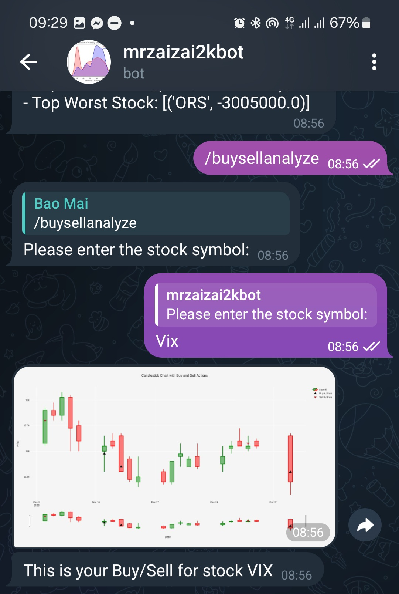

# Mrzaizai2k Stock Assistant Bot

[](https://github.com/mrzaizai2k/stock_price_4_fun)
[](https://opensource.org/licenses/MIT)
[](https://github.com/mrzaizai2k/stock_price_4_fun/releases)

   
  

## Table of Contents
1. [Introduction](#introduction)
2. [Available Commands](#available-commands)
3. [How to Use](#how-to-use)
3. [How to Set Up the Bot](#how-to-set-up-the-bot)
3. [Warning Price](#warning-price)
3. [Database](#database)
3. [Open VScode tunnel](#open-vscode-tunnel)
3. [Summarize Sound](#summarize-sound)
3. [Summarize News](#summarize-news)
3. [Example Uses](#example-uses)
3. [To-Do List](#to-do-list)

## Introduction
Welcome to the Mrzaizai2k Stock Assistant bot! This bot is designed to assist you with various stock-related tasks and analyses. Whether you want to calculate the payback time for a stock, find support and resistance levels, or receive warnings about specific market conditions, this bot has you covered.

## Available Commands
1. `/start`: Initializes the bot and provides a welcome message.
2. `/help`: Displays a list of available commands and their descriptions.
3. `/pbt`: Calculates the payback time for a specific stock.
4. `/snr`: Finds the closest support and resistance levels for a stock.
5. `/findpbt`: Identifies stocks with favorable payback times.
6. `/findmyfav`: Recommends stocks based on specified criteria.
7. `/risk`: Calculates the number of stocks you can buy with a given loss/trade percentage and maximum loss/capital percentage.
8. `/rate`: Provides a general rating for a stock.
9. `/mulpattern`: Finds patterns of a stock on multiple dimensions (close, volume).
10. `/pattern`: Finds patterns of a stock based on closing prices.
11. `/findbestmotif`: Identifies the best motifs across all stocks.
12. `/buysellanalyze`: Picture of my Buy/Sell of a stock (FPTS data)
13. `/winlossanalyze`: Analyze my Win/Loss trading for the last 6 months (FPTS data)
14. `/watchlist`: See/change your watch list
15. `/remote`: Open remote tunnel to vscode on my latop.
16. `/summarynewsurl`:  Summary news from arbitrary url
17. `/scrape`:  Manually scrapinscraping trading data and news


## How to Use
1. Start a command with a forward slash ("/") followed by the desired command.
   - Example: `/pbt`
2. Follow the bot's prompts to enter additional information, such as stock symbols or dates.
3. Wait for the bot to process your request. Some commands may take several minutes.
4. Review the bot's responses for the calculated results, warnings, or recommended stocks.

## How to Set Up the Bot

### Prerequisites
Before running the Mrzaizai2k Stock Assistant Bot, follow these steps to set up the environment:

1. **Clone the Repository:**
   - Close the Git repository to your local machine:
     ```bash
     git clone [repository_url]
     ```

2. **Install Dependencies:**
   - Navigate to the project directory and install the required packages using the provided `setup_win.txt` file:
     ```bash
     pip install -r setup_win.txt
     ```

3. **Get TELEBOT_API Key:**
   - Go to [BotFather](https://t.me/botfather) on Telegram and create a new bot.
   - Copy the generated `TELEBOT_API` key.

4. **Create .env File:**
   - Create a new file named `.env` in the project root directory.
   - Add the following line to the file, replacing `YOUR_TELEBOT_API_KEY` with the key obtained from BotFather:
     ```env
     TELEBOT_API=YOUR_TELEBOT_API_KEY
     TRADE_USER=YOUR_TRADING_USER
     TRADE_PASS=YOUR TRADING PASSWORD
     ```

5. **Update Config:**
   - You have to update the config in `config/config.yaml` file. i.e time to warning, data path,...
   - `.txt` file to save long text like the `/start` or `/help` commands 

5. **Run the Bot:**
   - Execute the following command to run the Mrzaizai2k Stock Assistant Bot:
   
         python src/stock_bot.py

   - Or you can run with Makefile on Linux:

         make bot

6. **Interact with the Bot:**
   - Once the bot is running, open Telegram and start interacting with the bot using the available commands.

## Warning Price

   The bot can also warning you about the stock in watchlist in times that you have set in  `config/config.yaml`. The time would be in format `HH:MM`. Note: '06:50' not '6:50'

1. **`warning_macd` Function:**
   - **Purpose:** This function generates warnings based on MACD (Moving Average Convergence Divergence) analysis for stocks in the provided watchlist.
   - **Warnings:** Detects if a stock has crossed up or down based on MACD with a specified offset.

2. **`warningbigday` Function:**
   - **Purpose:** Generates warnings for stocks with significant price movements (big days).
   - **Warnings:** Identifies powerful increases or decreases in stock prices.

3. **`warningpricevsma` Function:**
   - **Purpose:** Provides warnings based on the relationship between stock prices and Moving Averages (MA).
   - **Warnings:** Detects if a stock has crossed up or down in relation to its Moving Average with a specified offset.

4. **`warningsnr` Function:**
   - **Purpose:** Warns about stocks approaching or meeting support/resistance levels.
   - **Warnings:** Identifies if a stock is meeting support or resistance levels within a specified tolerance percentage.

## Database

1. User database:

   The chatbot utilizes a user database stored in `./memory`. When a new user executes the `/watchlist` command, the chatbot automatically checks if the user is in the database. The database contains the following information:

   - user_id: Unique identifier for users.
   - watch_list: List of stocks associated with each user.
   - step: User's progress step in the chatbot's functionality.

   This user database is a crucial component, enabling seamless interactions and personalized experiences for users. The database is actively used in various functions throughout the bot.

2. Scrape data trading: 
   
   The chatbot employs Selenium to scrape trading data from FTPS. The scraped data provides insights into buy/sell periods and facilitates analysis of win/loss trading patterns. The code for this functionality is available in src/trading_record.py. This feature enhances the chatbot's capability to provide valuable trading analytics. The code can be found in `src/trading_record.py`

3. Scrape news:

   The bot has the capability to scrape news specifically related to the stocks on your watchlist. Additionally, it can provide a brief summary of the top news, offering insights into the market before the trading session begins.
   
   I have enhanced the crawling functionality using LangChain, allowing the bot to precisely extract news text from any given URL. This improvement ensures accurate and relevant information retrieval.
   
   To quickly obtain a summary from a URL, you can utilize the /summarynewsurl command. This feature enhances user convenience and efficiency.
   
   Currently, the news data is stored in a json file. However, I am planning to implement an update to MongoDB in the future. This transition aims to improve data management and accessibility.


## Open VScode tunnel 

As to this [link](https://code.visualstudio.com/docs/remote/tunnels#:~:text=In%20the%20VS%20Code%20Account,prompted%20to%20log%20into%20GitHub), you need to first set up the tunnel in your code

      curl -Lk 'https://code.visualstudio.com/sha/download?build=stable&os=cli-alpine-x64' --output vscode_cli.tar.gz

      tar -xf vscode_cli.tar.gz

Then use this command in CLI

      ./code tunnel

Or in the `src/stock_bot.py`

      result = subprocess.run(command, check=True, text=True)

Whenever you want to run your bot remotely, but got this issue: "make sure that only one bot instance is running". Please kill bot first

      make kill
      make bot

## Summarize Sound

The bot is in development to summarize all sounds from audio or voice
.It can recognize sounds with various formats such as `.mp3, .wav,.ogg,.m4a` with [Whisper](https://github.com/openai/whisper) 

To setup Whisper 

      pip install git+https://github.com/openai/whisper.git 
      # on Ubuntu or Debian
      sudo apt update && sudo apt install ffmpeg

Then I use Google Translate API to translate the text to English. All the code can be found `src/summarize_text.py`

I am trying some summarize model but has some withdraws (the model is too big, or too dump)

The bot can also transform your text into to-do list. you can click to toggle the checklist 

## Summarize News
The bot can also summarize news related to your watchlist stocks and the market. I use a light Falcon model and Langchain for the summarization which help me to get a precise and quick summary from the news


## Example Uses

Explore practical implementations and demonstrations of the chatbot's functions in the `notebook` folder. These examples showcase real-world scenarios, illustrating how the chatbot can be effectively utilized for stock market monitoring.


## To-Do List

- [ ] **Stock Prediction with TFT Model**
- [ ] **Update DataBase using PostGreSQL and MongoDB**
- [ ] **User_ID Encryption**
- [ ] **Back Testing Bot**
- [ ] **Make a youtube video about this bot**

Note: Ensure that you have Python installed on your machine and the necessary permissions to install packages and run scripts.


Feel free to explore the various commands and leverage the bot for your stock-related analyses. If you have any questions or encounter issues, type `/help` for assistance. Happy investing!

